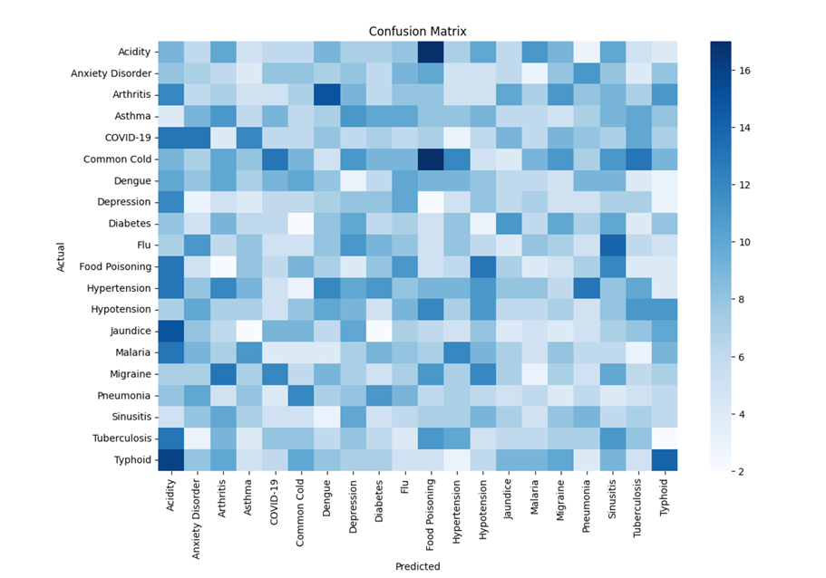

# 🩺 Disease Prediction System

An intelligent Machine Learning application that predicts diseases based on patient symptoms using a Random Forest Classifier. The system also recommends basic precautions after prediction.

---

## 📖 Overview

This project leverages Machine Learning to analyze symptom data and predict possible diseases. A Random Forest Classifier is trained on a symptom dataset containing multiple diseases and is capable of generating predictions based on user-selected symptoms.

---

## ✨ Features

- Disease prediction using Machine Learning
- Symptom-based diagnosis
- Random Forest Classifier
- Interactive symptom selection
- Recommended precautions after prediction
- Confusion Matrix visualization

---

## 🛠️ Tech Stack

- Python
- Pandas
- NumPy
- Scikit-learn
- Matplotlib
- Seaborn
- Google Colab
- ipywidgets

---

## 📂 Dataset

- Training Dataset
- Testing Dataset
- 40 symptom features
- Multiple disease classes

---

## ⚙️ Machine Learning Workflow

1. Load dataset
2. Data preprocessing
3. Label Encoding
4. Train-Test Split
5. Random Forest Model Training
6. Disease Prediction
7. Precaution Recommendation

---

## 📸 Screenshots

## 📊 Confusion Matrix

### Prediction Interface

(Add image here)

---

## 🚀 Future Enhancements

- Flask Web Application
- Voice-based symptom input
- Deep Learning models
- Hospital API integration
- Cloud Deployment

---

## 👨‍💻 Author

**Sathvik Kotapuri**

B.Tech CSE (AI & ML)
